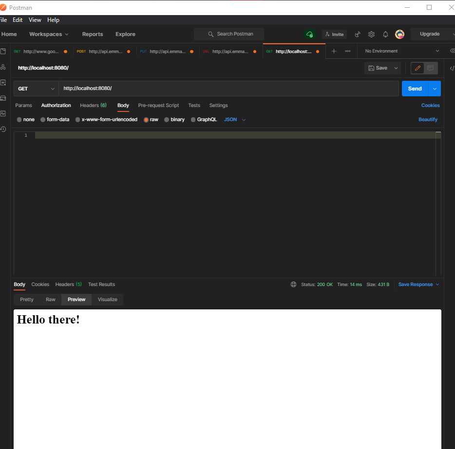
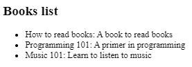
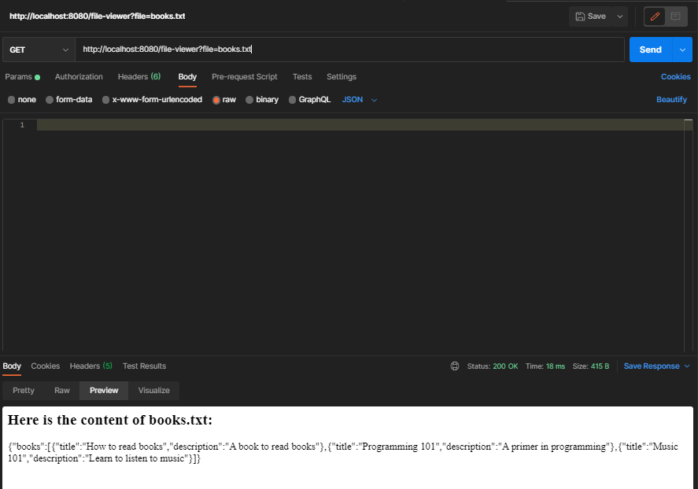
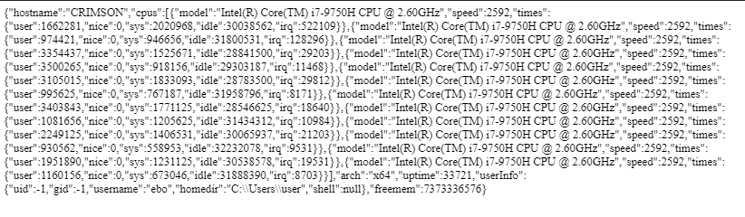

# Node practice tasks

## Completion status

- [X] Task 1
- [X] Task 2
- [X] Task 3

## How to use task3 (with postman)

    The server will run by default in the port 8080 of the localhost.

Sending a GET request to / should return a welcome message to the client as shown below:

A GET request to /books will return a list of the contents of the books.txt file. The default contents are shown below:

A PATCH request will expect a valid JSON object in the body of the request. If the operation is successful, a confirmation message displays to the client.

A PUT request will clear the content of the books.txt file. The body must be empty or an error will be returned to the client. A successgul request will return No Content (204).

A GET request to /file-viewer will expect a query parameter with the name of the file. Only files inside the public folder are accessible to the client. Trying to access files behind public results in 403 (Forbidden) while a bad route will return a 400 (Bad request). An example of a correct request is shown below:

A GET request to will display a JSON with relevant stats of the server.

